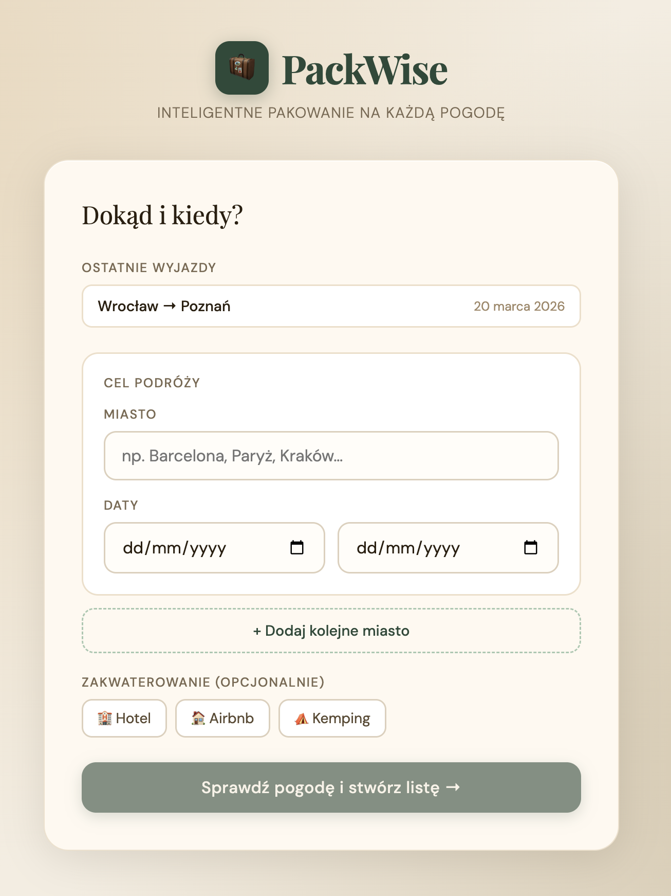
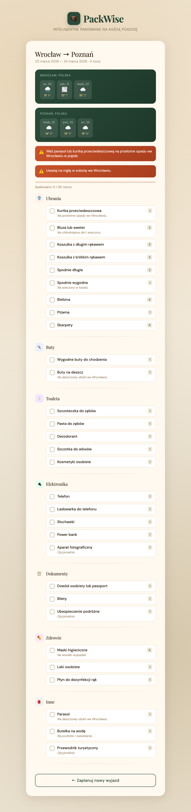

# PackWise 🧳

Inteligentna lista pakowania dopasowana do pogody i trasy podróży.

### Widok ogólny


### Szczegóły listy


## Jak działa

1. Wpisz miasto docelowe — autocomplete podpowiada nazwy miast
2. Wybierz daty wyjazdu
3. Opcjonalnie dodaj kolejne miasta (trasy wieloetapowe) i zaznacz typ zakwaterowania
4. Aplikacja pobiera prognozę pogody (Open-Meteo), wysyła ją do GPT-4o i generuje spersonalizowaną listę pakowania
5. Odznaczaj rzeczy w miarę pakowania — postęp widoczny na pasku
6. Ostatnie wyszukiwania są zapamiętywane lokalnie w przeglądarce

## Uruchomienie

```bash
cp .env.example .env
# uzupełnij VITE_OPENAI_API_KEY w pliku .env

npm install
npm run dev
```

Aplikacja dostępna pod `http://localhost:5173`.

## Wymagania

- Node.js 18+
- Klucz API OpenAI (https://platform.openai.com/api-keys)
